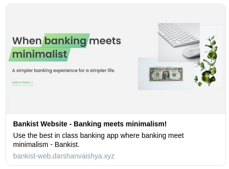
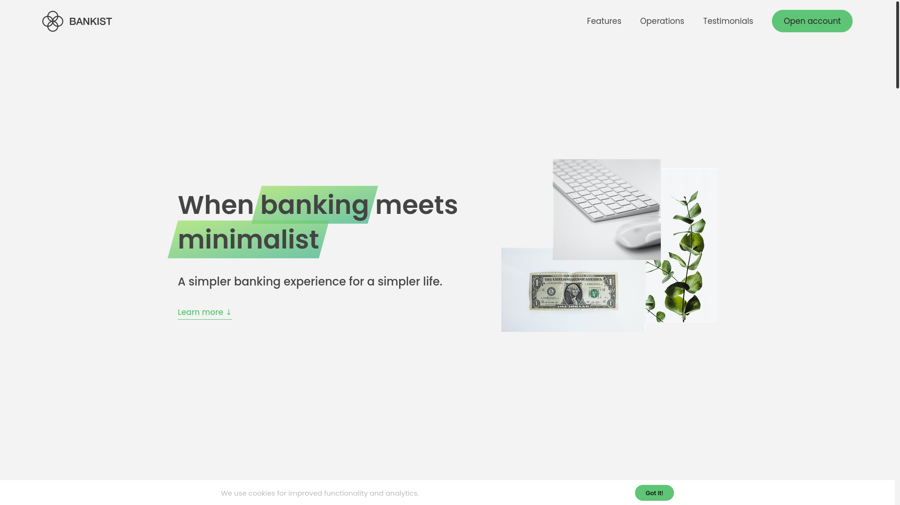
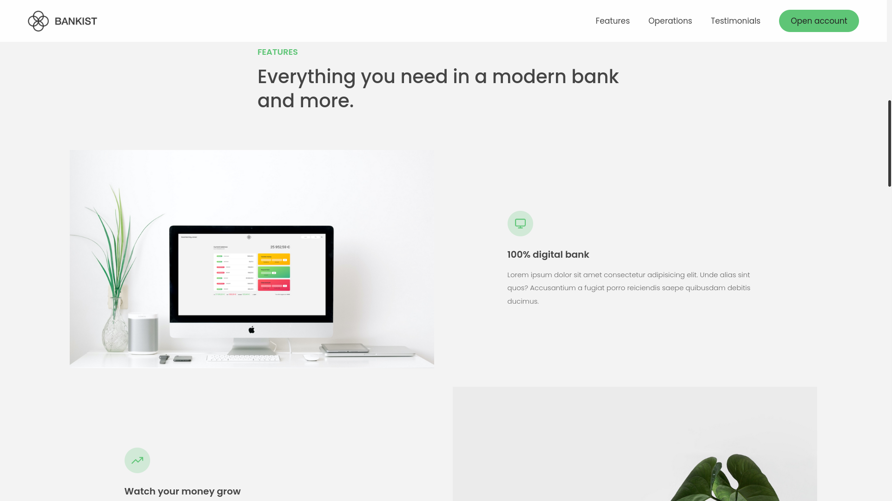
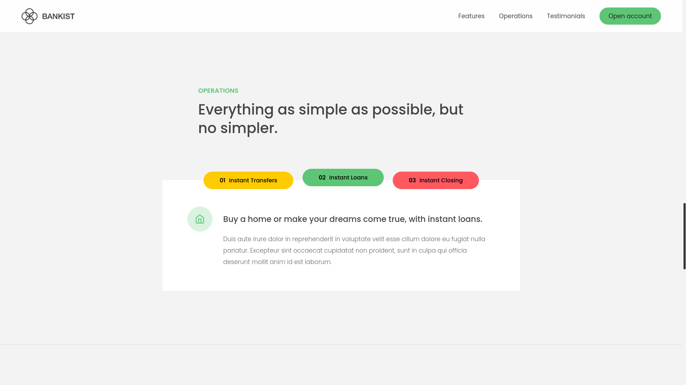
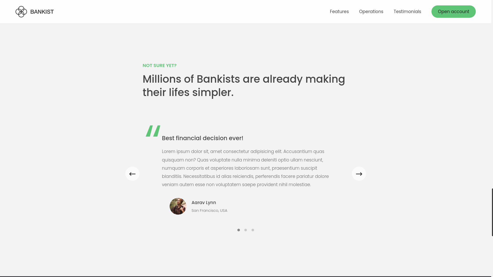
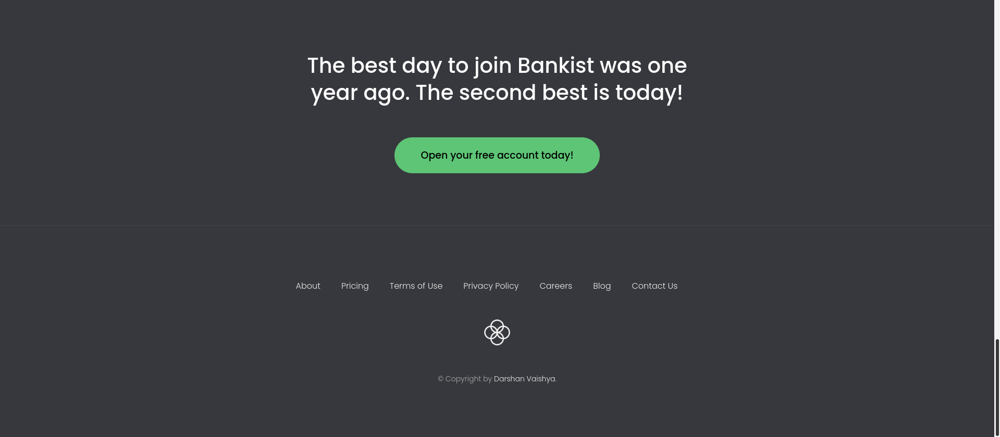

# Bankist Website (21st Jan, 2022)

## Table of contents

- [Overview](#overview)
  - [Technologies used](#technologies-used)
- [Challenges faced](#challenges-faced)
- [Learning outcomes](#learning-outcomes)
- [Screenshots](#screenshots)
- [Directory structure](#directory-structure)
- [Collaboration](#collaboration)
- [Contact me](#contact-me)

## Overview

This website is created for a fictional bank named Bankist. The website has a beautiful and easy to use UI which is fully responsive to Desktop, Tablet and Mobile view. It has features such as lazy image loading, testimonials carousel and modal windows.

Live preview: [Link](https://bankist-web.darshanvaishya.xyz/)

[](https://app.netlify.com/sites/pensive-ramanujan-f44c07/deploys)

### Technologies used

- HTML
- CSS
- Javscript
- Intersection Observer API
- Open Graph Meta Tags

## Challenges faced

For this project, I wanted create my own version of lazy image loading instead of relying on HTML method. Now I needed a way to check whether the image is visible to the user or not. The intersection observer API was great for this task. At first, images loaded were of low quality and had a blur effect. Once the image is in the viewport, I replace it with the HD version and remove the blur effect.

```js
function revealImage(entries, observer) {
	entries.forEach((entry) => {
		if (!entry.isIntersecting) return;

		const img = entry.target;
		img.src = img.dataset.src;
		img.addEventListener("load", () => img.classList.remove("lazy-img"));
		observer.unobserve(img);
	});
}

const imgObserver = new IntersectionObserver(revealImage, {
	root: null,
	threshold: 0,
	rootMargin: "200px",
});
lazyImages.forEach((img) => imgObserver.observe(img));
```

The `rootMargin: 200px` starts loading images 200px before its start.

Second challenge was creating an carousel element on the page. I knew to set it up in CSS, but JavaScript part was a mystery to me. In the end, I used a simple function which changed slide's `transform: translateX()` based on its index and index of currently visible slide.

```js
function updateSlides() {
	slides.forEach((slide, index) => {
		slide.style.transform = `translateX(${(index - curSlide) * 100}%)`;
	});
	activateDot();
}
```

## Learning outcomes

I learnt about event delegation while making the navigation bar effect. This was really mind blowing, and made me understand concept of event bubbling in more detail. I understood the importance of event delegation and how a lot of event listeners can lead to reduced website performance.

Another thing I learned is implementing smooth scrolling using JavaScript. I used both `window.scrollTo()` and `element.scrollIntoView()`.

## Screenshots

### Open Graph card



### Hero section



### First section



### Tabbed information



### Testimonials carousel



### Footer section



## Directory structure

```
.
├── index.html
├── README.md
└── static
    ├── css
    │   ├── queries.css
    │   └── style.css
    ├── img
    │   ├── card.jpg
    │   ├── card-lazy.jpg
    │   ├── digital.jpg
    │   ├── digital-lazy.jpg
    │   ├── grow.jpg
    │   ├── grow-lazy.jpg
    │   ├── hero.png
    │   ├── icon.png
    │   ├── icons.svg
    │   ├── img-1.jpg
    │   ├── img-2.jpg
    │   ├── img-3.jpg
    │   ├── img-4.jpg
    │   ├── logo.png
    │   ├── og-image.png
    │   ├── screenshots
    │   │   ├── footer.png
    │   │   ├── main.png
    │   │   ├── og-tag.png
    │   │   ├── section1.png
    │   │   ├── tabbed.png
    │   │   └── testimonial.png
    │   ├── user-1.jpg
    │   ├── user-2.jpg
    │   └── user-3.jpg
    └── js
        └── script.js

5 directories, 29 files
```

## Collaboration

If you have found a bug, suggesting an improvement or want to collaborate then please raise an [issue](https://github.com/DarshanVaishya/bankist-website/issues) or create an [pull request](https://github.com/DarshanVaishya/bankist-website/pulls).

## Contact me

- [Twitter](https://twitter.com/darshan_vaishya)
- [LinkedIn](https://www.linkedin.com/in/darshan-vaishya-ba99001a9/)
